# OSInsert-Image-Composition

OSInsert 是一个两阶段的目标插入（object insertion）流水线，本仓库已经将
ObjectStitch、SAM 和 InsertAnything 的**推理所需最小代码**封装进
`libcom/os_insert` 包中，无需再额外 `git clone` 其它仓库即可完成推理。

- **第 1 阶段（ObjectStitch）**：在目标背景图上生成**粗糙合成结果**；  
- **第 2 阶段（SAM + InsertAnything）**：使用 SAM 得到前景插入区域 mask，
  并按老师示意图将 "原始背景 + ObjectStitch 结果 + SAM mask" 组合成
  source image & mask，送入 InsertAnything，得到**高质量最终插入结果**。

## 0. 效果示例（Results）

下表展示了若干样本在不同阶段的图像（从左到右依次为：背景、前景、
aggressive 模式（ObjectStitch + SAM + InsertAnything）、conservative 模式
（仅 InsertAnything））。

| 样本      | 背景（background）                                    | 前景（foreground）                                      | aggressive（OSInsert，全流程）                                   | conservative（InsertAnything）                                  |
|-----------|--------------------------------------------------------|---------------------------------------------------------|------------------------------------------------------------------|------------------------------------------------------------------|
| bottle    | 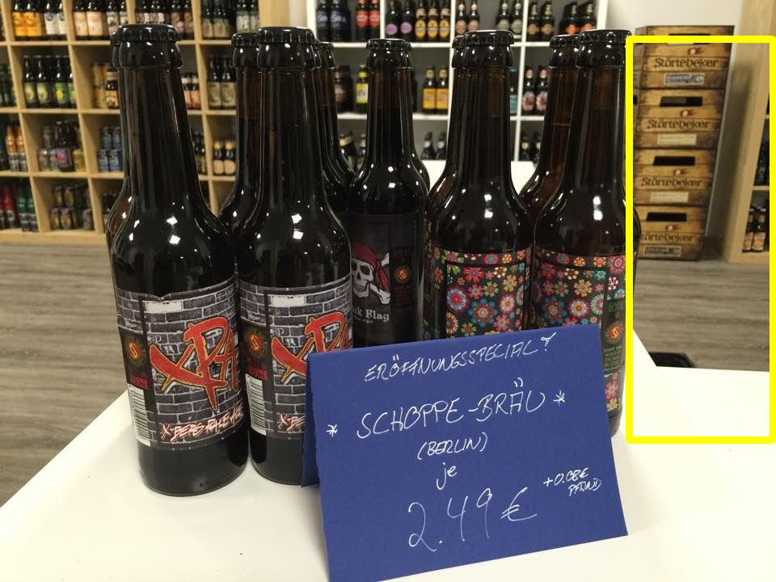       |       | 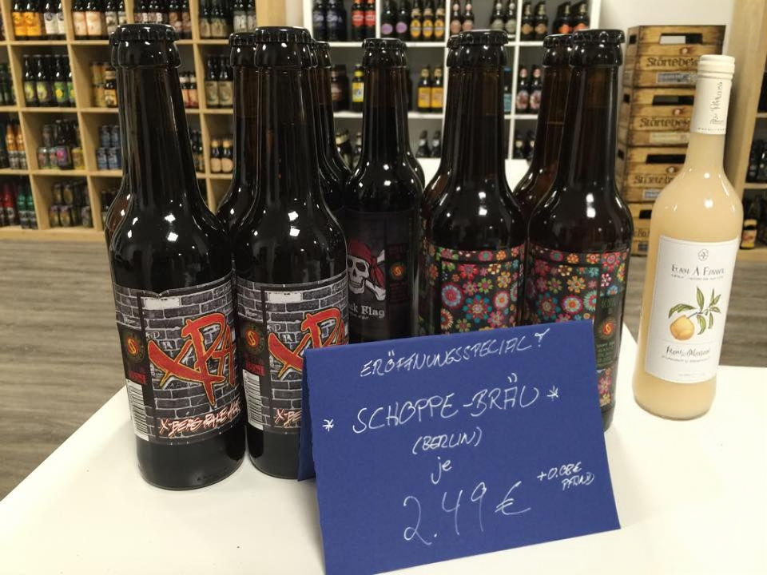                 | 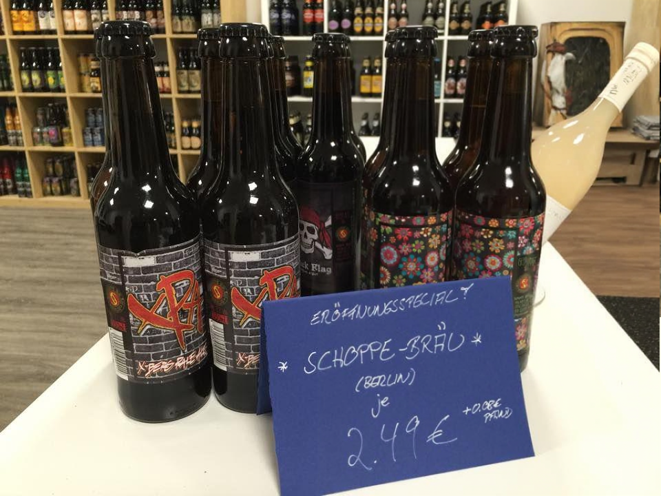          |
| box       | 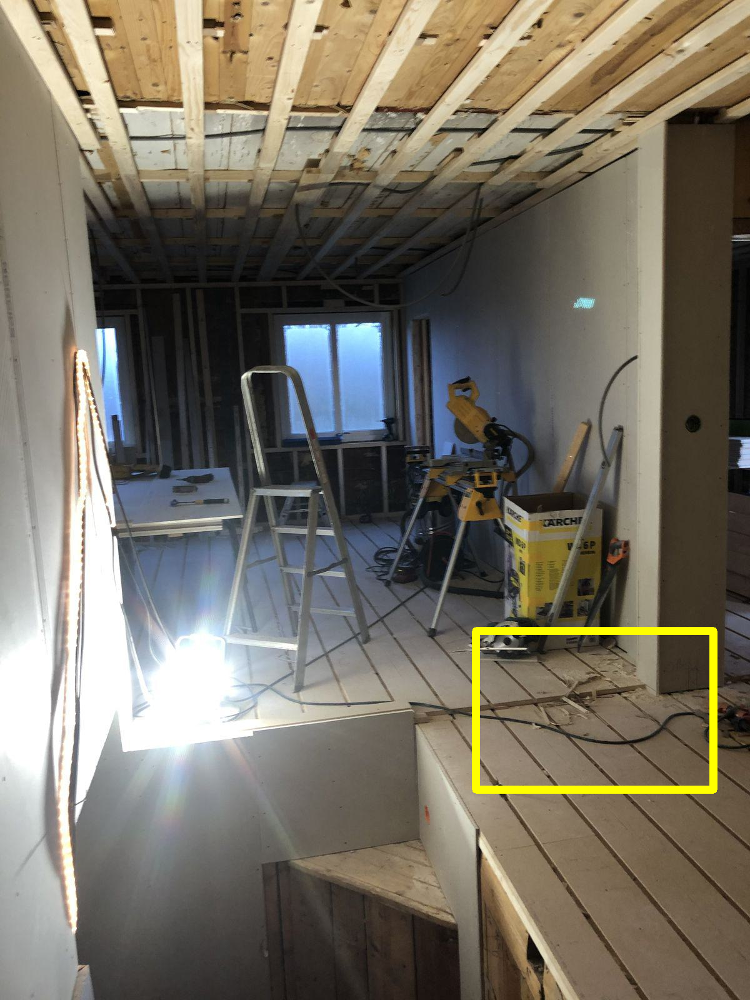             | 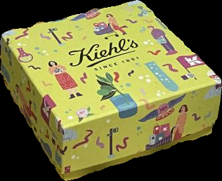            | 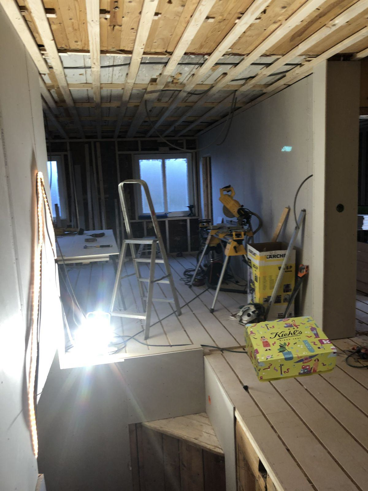                       | 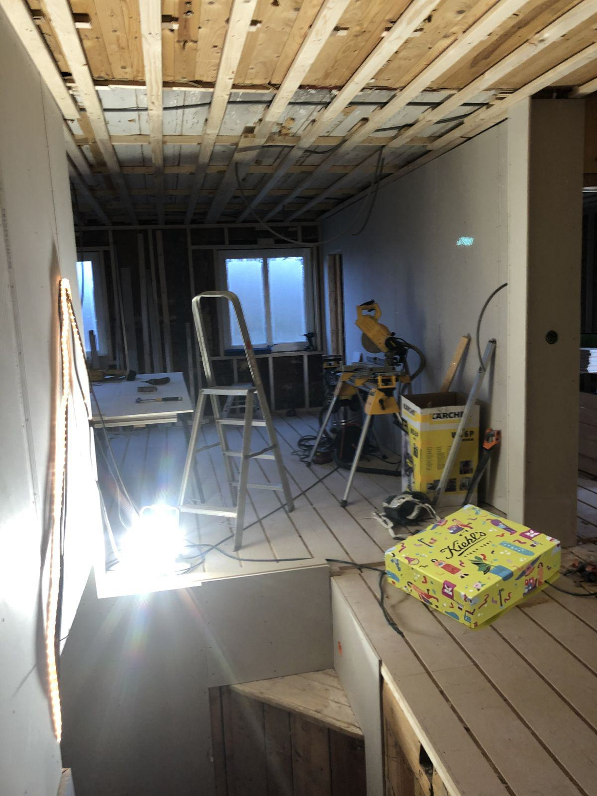                |
| bus       | 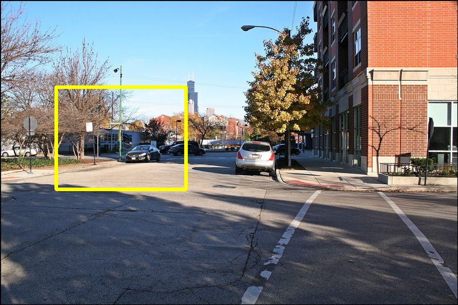             | 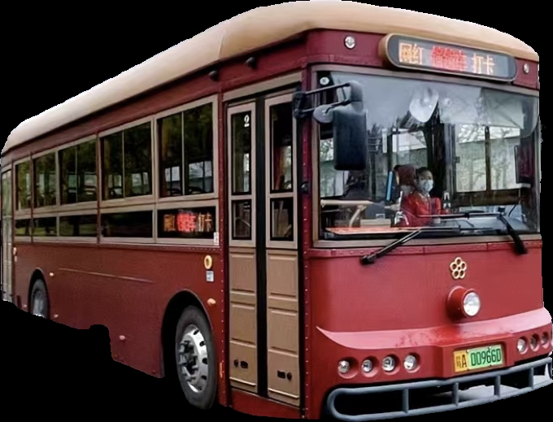            |                        |                 |
| cake      | 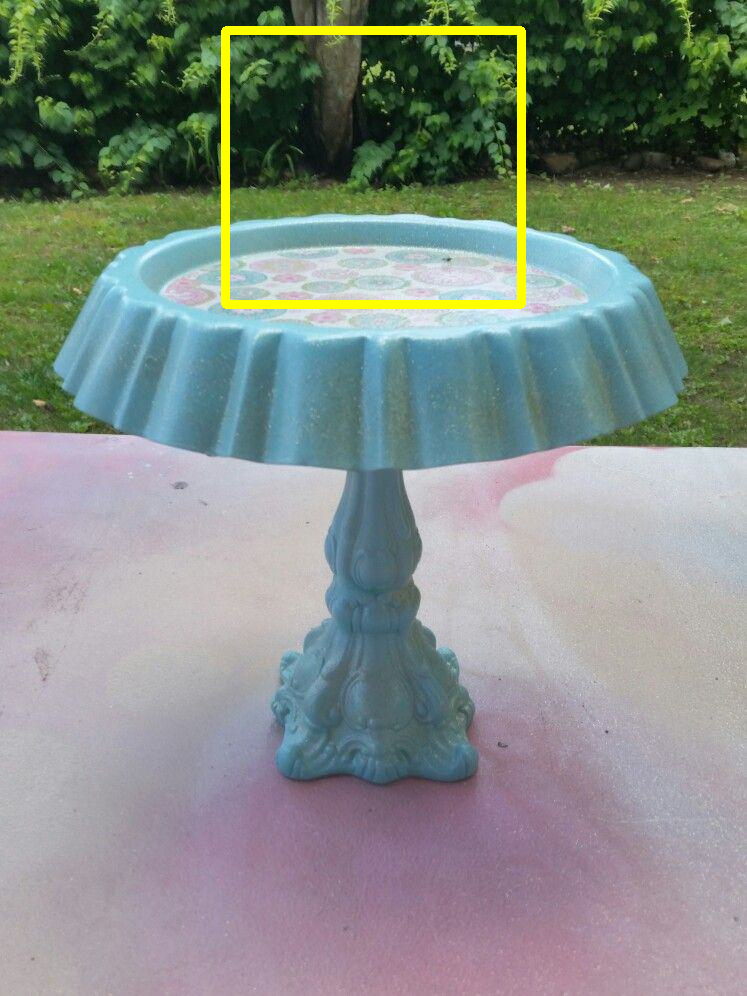           | 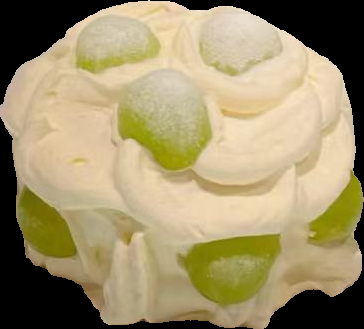          | 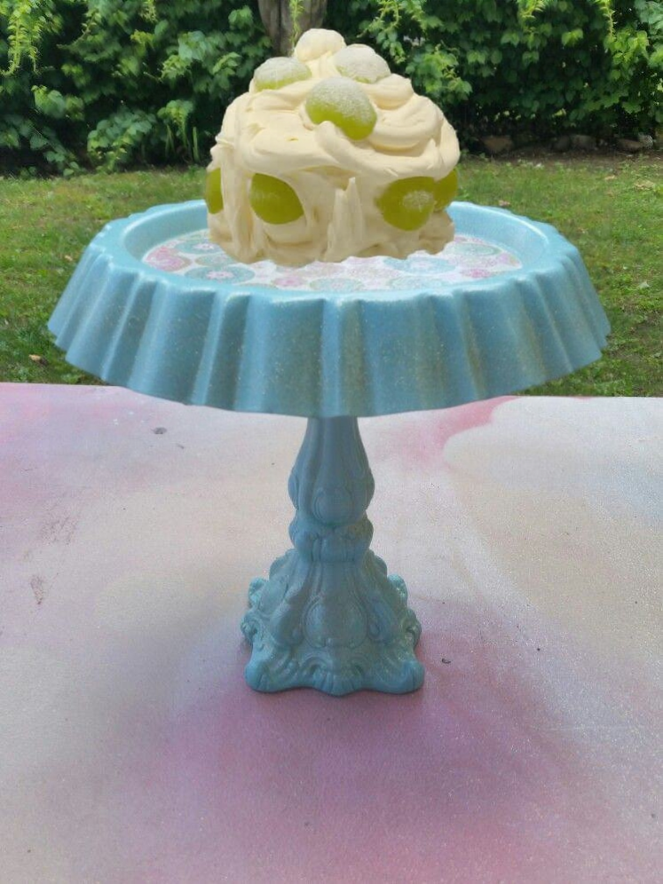                     |               |
| keyboard  | 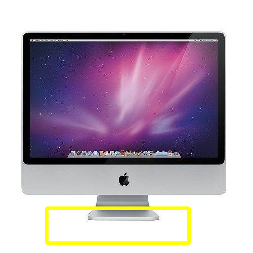   |   | 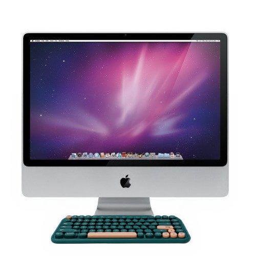             | 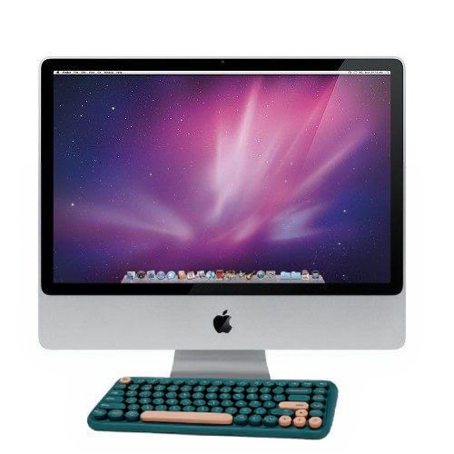      |
| frame     | 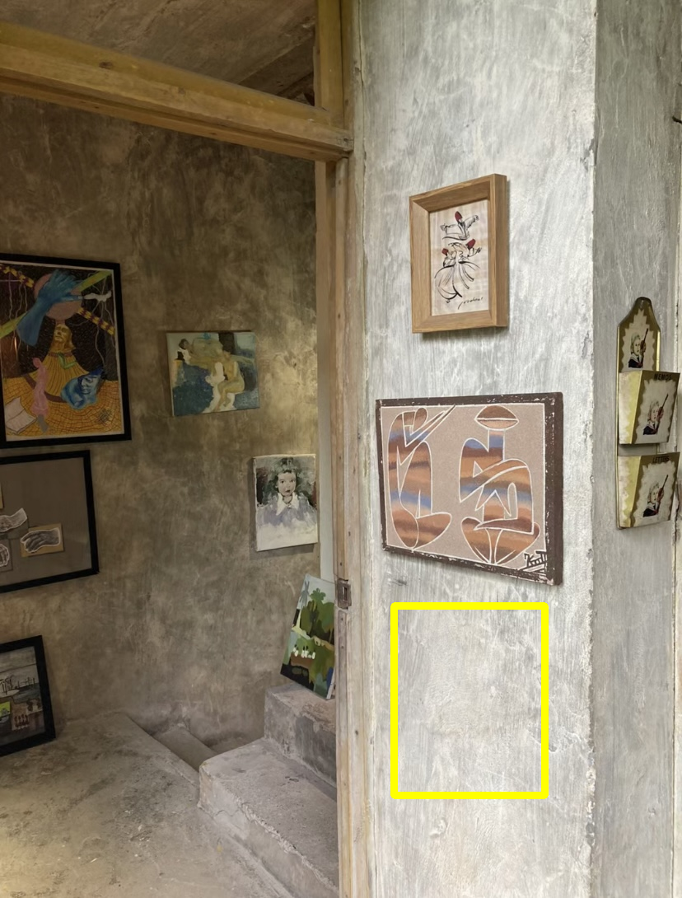         |         | 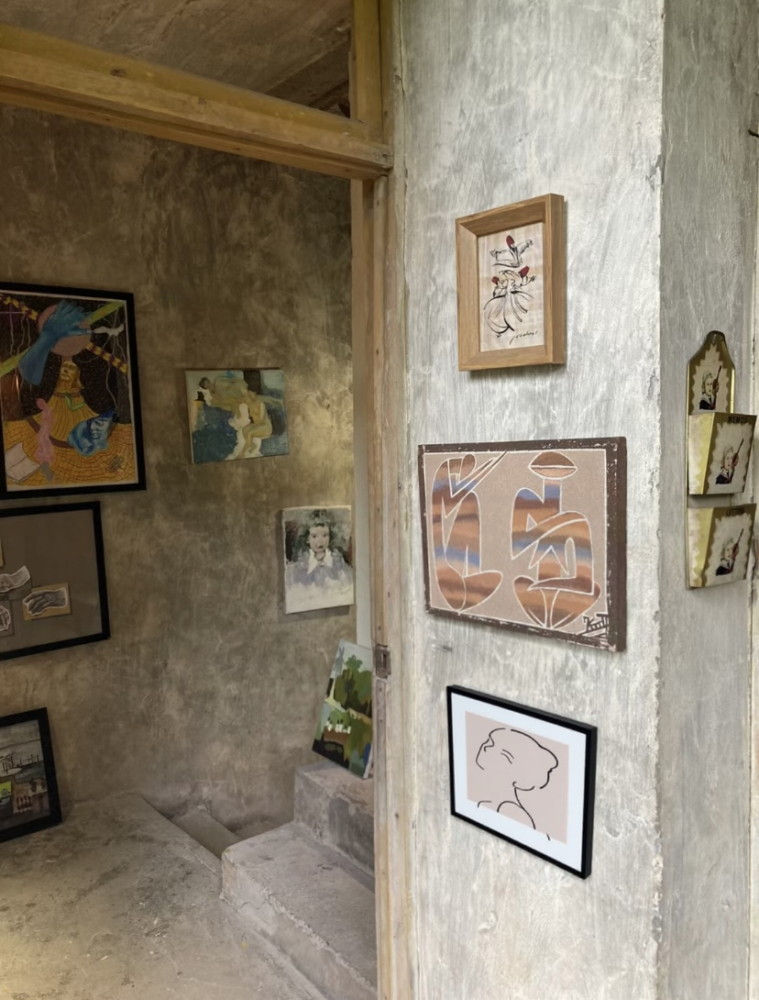                   | 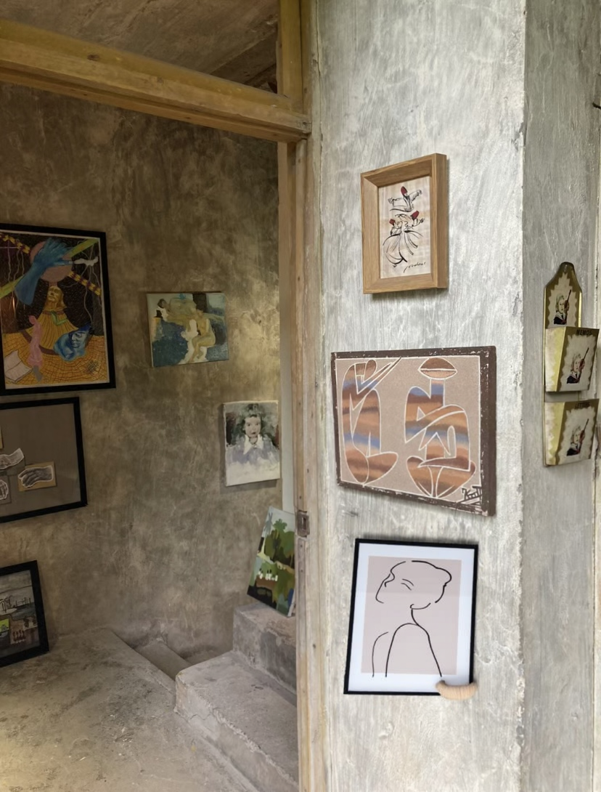            |

---

## 1. 环境说明（Environment）

推荐配置：

- 操作系统：Linux
- Python 3.10
- PyTorch ≥ 2.6.0

安装依赖示例：

```bash
conda create -n osinsert python=3.10
conda activate osinsert
pip install -r requirements.txt
```

> 注意：本仓库 **不包含任何预训练权重**。
> 自行下载并在脚本或配置中填入对应的路径。

---

## 2. 模型与目录结构（Models & Layout）

本仓库是**自包含**的，不再依赖外部 ObjectStitch / InsertAnything 仓库。所有
推理相关代码都在 `libcom/os_insert` 下，所有 checkpoint 统一放在
`pretrained_models/` 目录中：

```text
pretrained_models/
  flux/
    FLUX.1-Fill-dev/
    FLUX.1-Redux-dev/
  insert_anything/
    20250321_steps5000_pytorch_lora_weights.safetensors
  objectstitch/
    v1/
      model.ckpt                      # -> ObjectStitch.pth
      configs/
        v1.yaml
      openai-clip-vit-large-patch14/  # CLIP 权重目录
  sam/
    sam_vit_h_4b8939.pth
```

### 2.1 模型权重下载（Checkpoints）

- **ObjectStitch checkpoint**：参考原项目文档  
  <https://github.com/bcmi/ObjectStitch-Image-Composition>
- **SAM ViT-H**：`sam_vit_h_4b8939.pth`  
  官方直接下载链接：<https://dl.fbaipublicfiles.com/segment_anything/sam_vit_h_4b8939.pth>
- **InsertAnything LoRA**：   
  直接下载 LoRA：<https://huggingface.co/WensongSong/Insert-Anything/resolve/main/20250321_steps5000_pytorch_lora_weights.safetensors>
- **FLUX.1-Fill-dev / FLUX.1-Redux-dev**：  
  仓库主页：<https://huggingface.co/black-forest-labs/FLUX.1-Fill-dev>  
  直接下载 Fill 模型示例：<https://huggingface.co/black-forest-labs/FLUX.1-Fill-dev/resolve/main/flux1-fill-dev.safetensors>  
  仓库主页：<https://huggingface.co/black-forest-labs/FLUX.1-Redux-dev>

下载后，将它们整理到上述目录结构中即可。也可以通过环境变量覆写默认路径：

- `FLUX_FILL_PATH`
- `FLUX_REDUX_PATH`
- `IA_LORA_PATH`

如果未设置环境变量，会使用 `pretrained_models/...` 下的默认位置。

---

## 3. 数据格式（Data Format）

OSInsert 的数据格式与原 ObjectStitch 保持一致：

- `background/{uniq}.png`
- `foreground/{uniq}.png`
- `foreground_mask/{uniq}.png`
- `bbox/{uniq}.txt`（内容为 `x1 y1 x2 y2`）

TSV 列表文件包含如下列：

```text
uniq_id \t bg_path \t fg_path \t fg_mask_path
```

### 3.1 本仓库自带的 Demo 数据

为了方便快速体验，本仓库提供了一个**最小可运行 Demo**：

- `examples/samples_demo.tsv`
- `os_test_demo/background/Demo_0.png`
- `os_test_demo/foreground/Demo_0.png`
- `os_test_demo/foreground_mask/Demo_0.png`
- `os_test_demo/bbox/Demo_0.txt`

你可以：

- **直接复用**这些 Demo 文件测试流程是否正常；
- 或者用自己的图片替换上述文件，只要保持**相同的文件名和目录结构**；
- 或者完全新建一套 TSV + `os_test` 目录，然后在脚本参数中传入你自己的路径。

---

## 4. 一键 Demo：OSInsertModel

当前推荐的入口脚本是 `tests/test_os_insert.py`，直接调用
`libcom.os_insert.OSInsertModel`。不再需要 `osinsert/run_osinsert_full.py` 之类的
多脚本流水线。

### 4.1 Demo 数据

本仓库自带一组最小 Demo，位于：

- `tests/source/background/Demo_0.png`
- `tests/source/foreground/Demo_0.png`
- `tests/source/foreground_mask/Demo_0.png`
- `tests/source/bbox/Demo_0.txt`

你可以直接替换这些文件的内容（保持文件名不变），用自己的图片快速测试。

### 4.2 运行 conservative / aggressive 模式

`tests/test_os_insert.py` 支持通过 `--mode` 选择运行模式：

- `conservative`：仅使用 InsertAnything，在背景图的 bbox 区域内进行插入；
- `aggressive`：完整两阶段流水线：ObjectStitch → SAM → InsertAnything。

示例命令：

```bash
conda activate osinsert
cd OSInsert-Image-Composition

# 只跑 conservative（默认）
python -m tests.test_os_insert --mode conservative

# 只跑 aggressive（ObjectStitch + SAM + InsertAnything）
python -m tests.test_os_insert --mode aggressive
```

运行结束后，你可以在：

- `tests/result_dir/osinsert_demo/` 中查看 conservative 结果；
- `tests/result_dir/osinsert_demo_aggressive/` 中查看 aggressive 结果。

在 aggressive 模式下，如果将 `cleanup_intermediate=False`，还会额外保留：

- `objectstitch_coarse.png`：ObjectStitch 粗合成结果；
- `objectstitch_coarse_sam_mask.png`：SAM 在粗合成上的原始 mask；
- `objectstitch_coarse_sam_blend.png`：bg 与 ObjectStitch 结果按 SAM mask 混合后的 source；
- `objectstitch_coarse_sam_mask_resized.png`：已经 resize 到 bg 尺寸、用于 InsertAnything 的 mask。

如果 `cleanup_intermediate=True`，这些中间文件会在推理结束后自动清理，仅保留
最终输出图像。

### 4.3 OSInsertModel 接口概览

`libcom/os_insert/os_insert.py` 中提供了统一的 `OSInsertModel`：

```python
from libcom.os_insert import OSInsertModel

model = OSInsertModel(model_dir="pretrained_models", device="cuda:0")

model(
    background_path="tests/source/background/Demo_0.png",
    foreground_path="tests/source/foreground/Demo_0.png",
    foreground_mask_path="tests/source/foreground_mask/Demo_0.png",
    bbox_txt_path="tests/source/bbox/Demo_0.txt",
    result_dir="tests/result_dir/osinsert_demo_aggressive",
    mode="aggressive",          # 或 "conservative"
    cleanup_intermediate=False,  # 是否保留中间结果
    seed=123,
    strength=1.0,
)
```

内部会自动完成：

- conservative：bg + bbox → 矩形 mask → InsertAnything；
- aggressive：
  - ObjectStitch：在 bg 上生成粗合成 `objectstitch_coarse.png`；
  - SAM：在粗合成上通过 bbox 提取 mask；
  - 混合：将 `bg` 与 `objectstitch_coarse` 按 SAM mask 混合，形成新的
    source & mask（尺寸与 bg 对齐）；
  - InsertAnything：在该区域内完成高质量插入。
