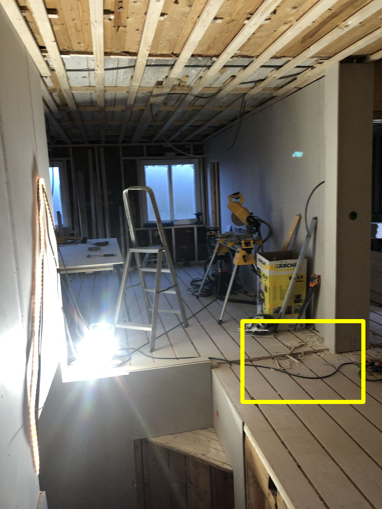
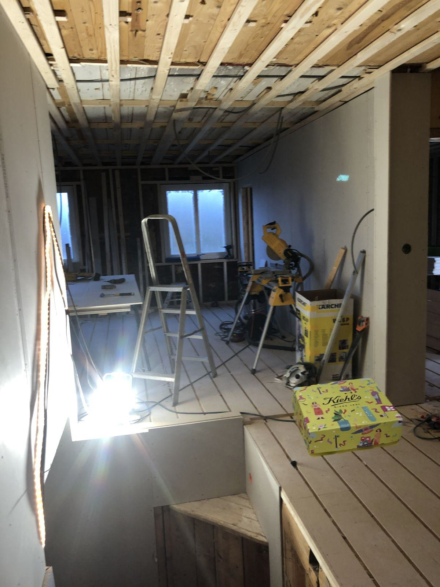
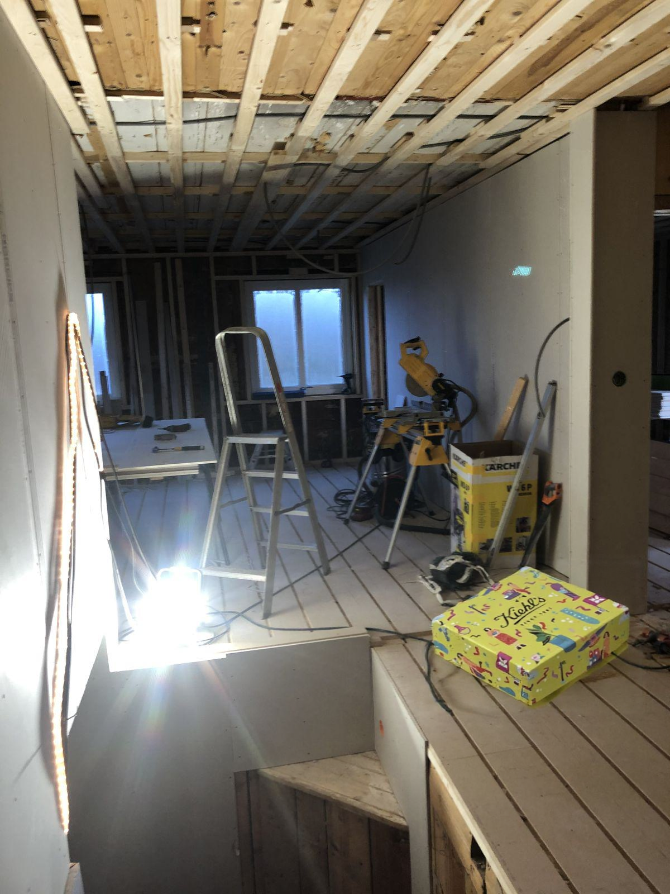
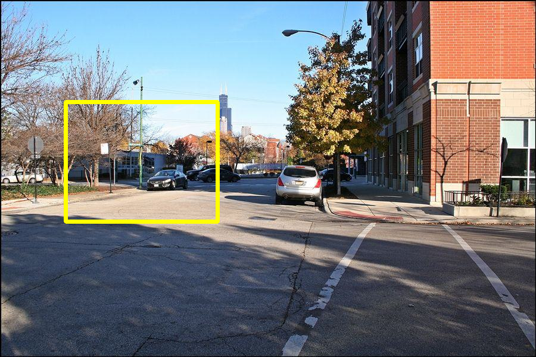
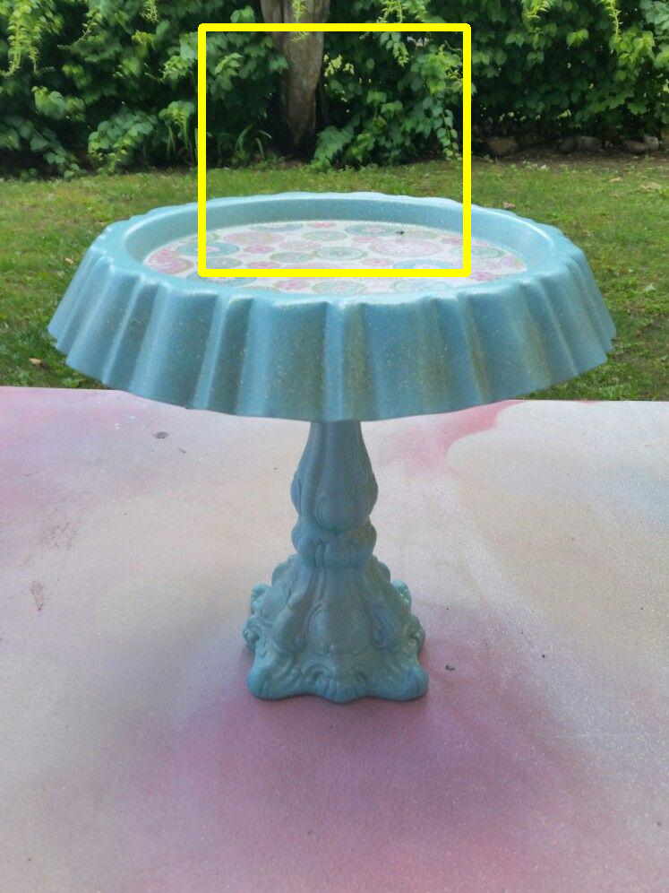
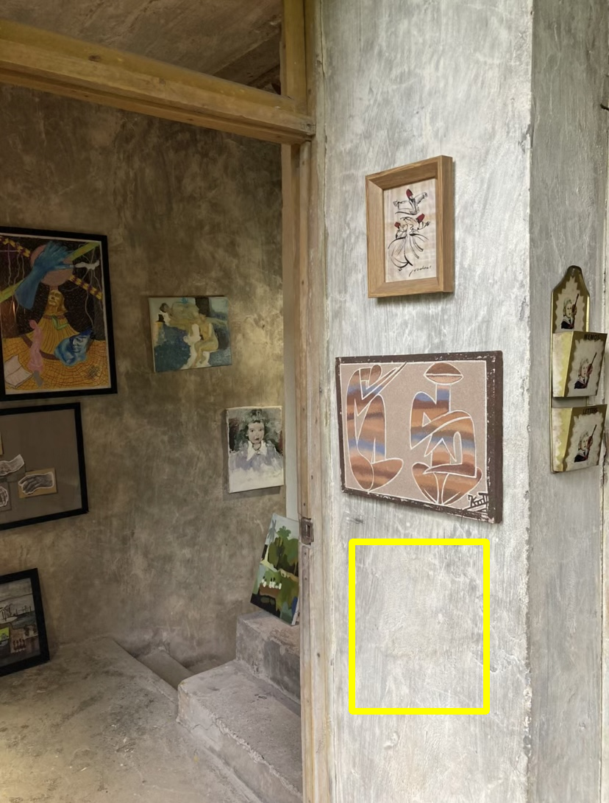
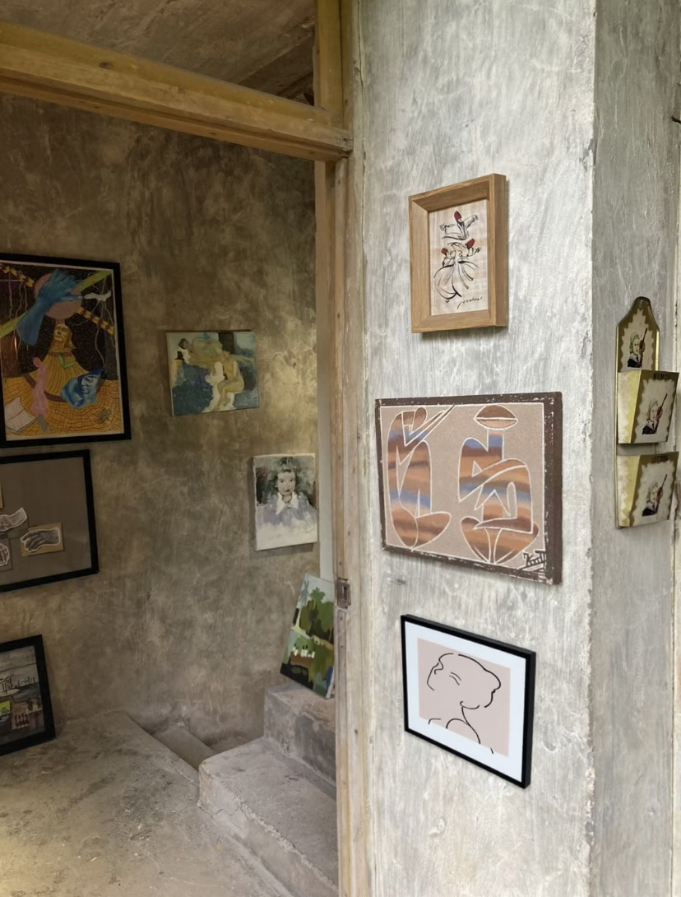
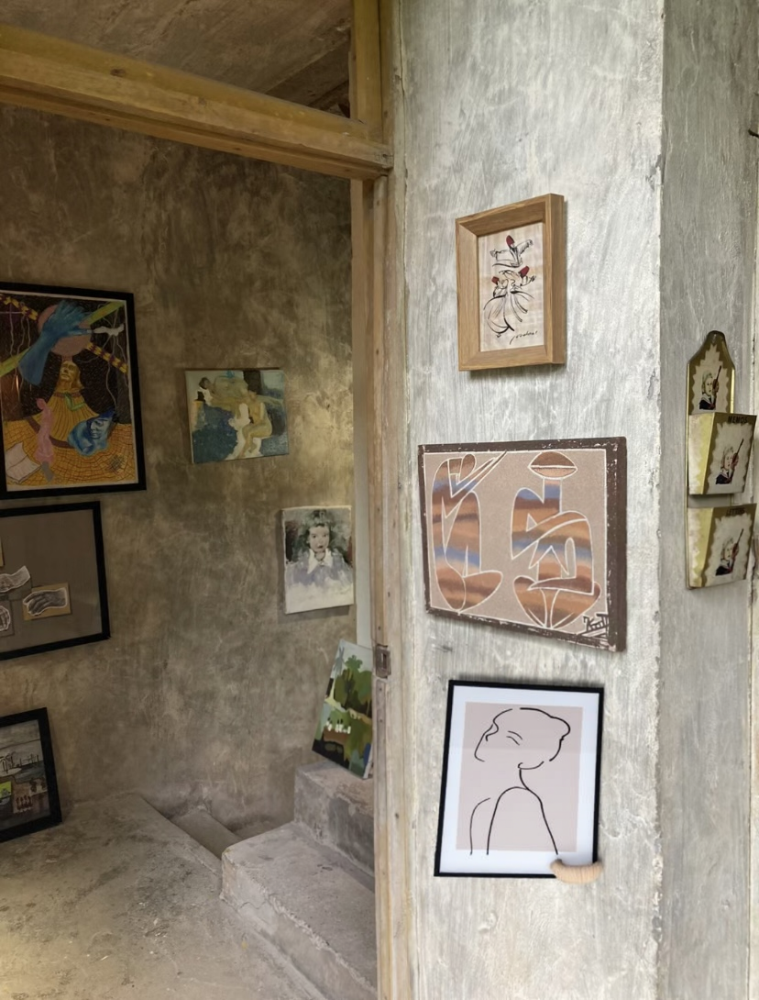

# OSInsert-Image-Composition

OSInsert is a two-stage object insertion pipeline built on top of
[ObjectStitch-Image-Composition](https://github.com/bcmi/ObjectStitch-Image-Composition),
[SAM (Segment Anything)](https://github.com/facebookresearch/segment-anything),
and [InsertAnything](https://github.com/song-wensong/insert-anything).

- **Stage 1 (ObjectStitch)**: generate a coarse composite on the target background.  
- **Stage 2 (SAM + InsertAnything)**: use SAM to obtain a foreground insertion mask,
  combine `background + ObjectStitch result + SAM mask` into source image & mask,
  then feed them into InsertAnything to obtain a high-quality final composite.

## 0. Results

The table below shows several examples at different stages
(from left to right: background, foreground, **aggressive** mode
ObjectStitch + SAM + InsertAnything, and **conservative** mode
InsertAnything-only):

| Sample    | Background                                           | Foreground                                              | aggressive (OSInsert full pipeline)                            | conservative (InsertAnything-only)                              |
|-----------|------------------------------------------------------|---------------------------------------------------------|----------------------------------------------------------------|-----------------------------------------------------------------|
| bottle    |      |       |                |           |
| box       |            |             |                      |                 |
| bus       |            |             |                      |                 |
| cake      |          |           |                    |               |
| keyboard  |  |   |            |       |
| frame     |        |         |                  |             |

---

## 1. Environment

**Recommended setup**

- OS: Linux
- Python 3.10
- PyTorch ≥ 2.6.0

Install dependencies (example):

```bash
conda create -n osinsert python=3.10
conda activate osinsert
pip install -r requirements.txt
```

> **Note:** This repository does **not** contain any pretrained weights.  
> You must download all checkpoints yourself and configure their paths.

---

## 2. External Repositories & Models

OSInsert does **not** vendor the source code of ObjectStitch or InsertAnything.  
You are expected to clone these repositories locally and reference them via
paths in the OSInsert scripts.

Assume you clone them under `/data/USER/projects`:

```bash
# ObjectStitch
cd /data/USER/projects
git clone https://github.com/bcmi/ObjectStitch-Image-Composition.git

# InsertAnything
cd /data/USER/projects
git clone https://github.com/song-wensong/insert-anything.git
```

Then, in `osinsert/run_osinsert_full.py`, set the corresponding defaults at the
top of the file (see Section 4.2).

### 2.1 Checkpoints

You need the following models (download the weights, then configure the paths
in `osinsert/run_osinsert_full.py`):

- **ObjectStitch checkpoint**  
  See the original project for download and usage:
  <https://github.com/bcmi/ObjectStitch-Image-Composition>
- **SAM ViT-H**: `sam_vit_h_4b8939.pth`  
  Official link: <https://dl.fbaipublicfiles.com/segment_anything/sam_vit_h_4b8939.pth>
- **InsertAnything LoRA** (recommended):  
  <https://huggingface.co/WensongSong/Insert-Anything>  
  Use the checkpoint
  `20250321_steps5000_pytorch_lora_weights.safetensors`.
- **FLUX.1-Fill-dev / FLUX.1-Redux-dev**:  
  <https://huggingface.co/black-forest-labs/FLUX.1-Fill-dev>  
  <https://huggingface.co/black-forest-labs/FLUX.1-Redux-dev>

After downloading, we recommend editing the defaults at the top of
`osinsert/run_osinsert_full.py`:

- `DEFAULT_FLUX_FILL_PATH`
- `DEFAULT_FLUX_REDUX_PATH`
- `DEFAULT_IA_LORA_PATH`
- `DEFAULT_SAM_CKPT`

You can also override them at runtime via environment variables
`FLUX_FILL_PATH`, `FLUX_REDUX_PATH`, and `IA_LORA_PATH`.

---

## 3. Data Format

OSInsert follows the `os_test` data structure from ObjectStitch:

- `background/{uniq}.png`
- `foreground/{uniq}.png`
- `foreground_mask/{uniq}.png`
- `bbox/{uniq}.txt` (content: `x1 y1 x2 y2`)

The TSV list file has the following columns:

```text
uniq_id \t bg_path \t fg_path \t fg_mask_path
```

### 3.1 Built-in Demo Data

For quick testing, this repository includes a **minimal runnable demo**:

- `examples/samples_demo.tsv`
- `os_test_demo/background/Demo_0.png`
- `os_test_demo/foreground/Demo_0.png`
- `os_test_demo/foreground_mask/Demo_0.png`
- `os_test_demo/bbox/Demo_0.txt`

You can:

- **Directly use** this demo to verify the pipeline runs correctly;
- Replace these demo images with your own, as long as you keep the **same
  file names and directory structure**;
- Or create your own TSV + `os_test`-style directory, and pass the paths via
  CLI arguments.

---

## 4. One-Click Demo (ObjectStitch + SAM + OSInsert)

After you:

- Create and activate the `osinsert` Conda environment;
- Clone the external repositories (ObjectStitch / InsertAnything);
- Edit the **user configuration** at the top of
  `osinsert/run_osinsert_full.py` (see Section 4.2):
  `DEFAULT_OBJ_REPO`, `DEFAULT_IA_REPO`, `DEFAULT_SAM_CKPT`, and default
  data directories;

You can run the full two-stage pipeline (ObjectStitch → SAM → InsertAnything)
with:

```bash
conda activate osinsert
cd OSInsert-Image-Composition
python osinsert/run_osinsert_full.py --mode aggressive
```

This script will:

1. Run **ObjectStitch** on `os_test_demo/`, saving outputs to
   `objectstitch_out_demo/`.
2. Run **SAM** on the ObjectStitch outputs, saving masks to
   `sam_masks_demo/`.
3. Run **OSInsert / InsertAnything**, saving final results to
   `osinsert_outputs_demo/`.

Internally, the Python script calls:

- `ObjectStitch-Image-Composition/scripts/inference.py`
- `osinsert/run_sam_on_objectstitch.py`
- `osinsert/run_osinsert_pipeline.py`

All three stages share the same Conda environment (`osinsert`).

### 4.1 Modes: aggressive vs conservative

`run_osinsert_full.py` provides two modes via the `--mode` flag:

- `--mode aggressive` (default):
  - Stage 1: run ObjectStitch on the `os_test`-style data to produce coarse
    composites.
  - Stage 2: run SAM on ObjectStitch outputs to obtain foreground masks.
  - Stage 3: assemble `background + ObjectStitch result + SAM mask` as
    source & mask, then feed into InsertAnything to get the final result.
- `--mode conservative`:
  - Skip ObjectStitch and SAM completely.
  - Directly use the original
    `background/foreground/foreground_mask/bbox`, and construct a rectangular
    mask from the bbox on the background.
  - Call InsertAnything on that region only, mimicking the **original
    InsertAnything usage**.

Examples:

```bash
# Two-stage OSInsert (default mode)
python osinsert/run_osinsert_full.py --mode aggressive

# Conservative mode: skip ObjectStitch/SAM, insert only in bg + bbox region
python osinsert/run_osinsert_full.py --mode conservative
```

If you do **not** want to keep intermediate results (ObjectStitch outputs,
SAM masks, temporary visualizations) after the run, you can add:

```bash
python osinsert/run_osinsert_full.py --mode aggressive --cleanup_intermediate
```

### 4.2 GPU & Path Configuration (Most Common Edits)

At the top of `run_osinsert_full.py`, all common defaults are centralized:

```python
# ========= User configuration (edit these defaults as needed) =========
DEFAULT_GPU = 1
DEFAULT_OBJ_REPO = "/data/USER/projects/ObjectStitch-Image-Composition"
DEFAULT_IA_REPO = "/data/USER/projects/insert-anything"
DEFAULT_SAM_CKPT = "/data/USER/models/sam/sam_vit_h_4b8939.pth"

REPO_ROOT = Path(__file__).resolve().parents[1]
DEFAULT_EXP_ROOT = REPO_ROOT
DEFAULT_LIST_FILE = REPO_ROOT / "examples" / "samples_demo.tsv"
DEFAULT_OS_TEST_ROOT = REPO_ROOT / "os_test_demo"
DEFAULT_OS_OUT = REPO_ROOT / "objectstitch_out_demo"
DEFAULT_SAM_MASK_ROOT = REPO_ROOT / "sam_masks_demo"
DEFAULT_OSINSERT_OUT = REPO_ROOT / "osinsert_outputs_demo"
DEFAULT_TMP_ROOT = REPO_ROOT / "osinsert_tmp_demo"
```

Recommended usage:

- Change `DEFAULT_OBJ_REPO`, `DEFAULT_IA_REPO`, and `DEFAULT_SAM_CKPT` to
  match your local paths.
- If you want all inputs/outputs under a unified directory
  (e.g. `/data/USER/osinsert_exp`), set `DEFAULT_EXP_ROOT` and the other
  `DEFAULT_*` paths accordingly.
- Afterwards, daily runs are usually as simple as:

  ```bash
  python osinsert/run_osinsert_full.py --mode aggressive   # or --mode conservative
  ```

For special cases (e.g. a different `os_test` directory or TSV file), you can
override paths from the command line:

```bash
python osinsert/run_osinsert_full.py \
  --mode aggressive \
  --gpu 0 \
  --exp_root /data/USER/osinsert_exp1 \
  --os_test_root /data/USER/os_test_50pairs \
  --list_file /data/USER/os_test_50pairs.tsv
```

