# OSInsert-Image-Composition

This is the official implementation of **OSInsert** for the following research paper:
> **OSInsert: Towards High-authenticity and High-fidelity Image Composition**  [[arXiv]](https://arxiv.org/pdf/2602.19523)<br>
>
> Jingyuan Wang, Li Niu

OSInsert is a two-stage object insertion pipeline. In the first stage, we use  [ObjectStitch](https://github.com/bcmi/ObjectStitch-Image-Composition) to generate the composite image with reasonable foreground pose/viewpoint and extract the foreground region. In the second stage, we use [InsertAnything](https://github.com/song-wensong/insert-anything) to fill in the foreground region with the appearance details of reference image. 

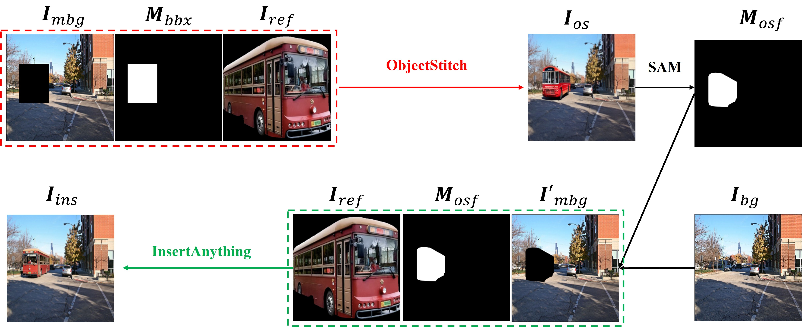 

## Online Demo

Try this [online demo](http://libcom.ustcnewly.com/) for image composition (object insertion) built upon [libcom](https://github.com/bcmi/libcom) toolbox and have fun!

[![]](https://github.com/user-attachments/assets/87416ec5-2461-42cb-9f2d-5030b1e1b5ec)

## 0. Example Results

The table below shows several examples of our results. From left to right: background, foreground, aggressive mode (OSInsert: ObjectStitch + SAM + InsertAnything), and conservative mode (InsertAnything only).

| Sample   | Background                                            | Foreground                                              | OSInsert                              | InsertAnything                                      |
|----------|-------------------------------------------------------|---------------------------------------------------------|--------------------------------------------------------------------|--------------------------------------------------------------------|
| bottle   | 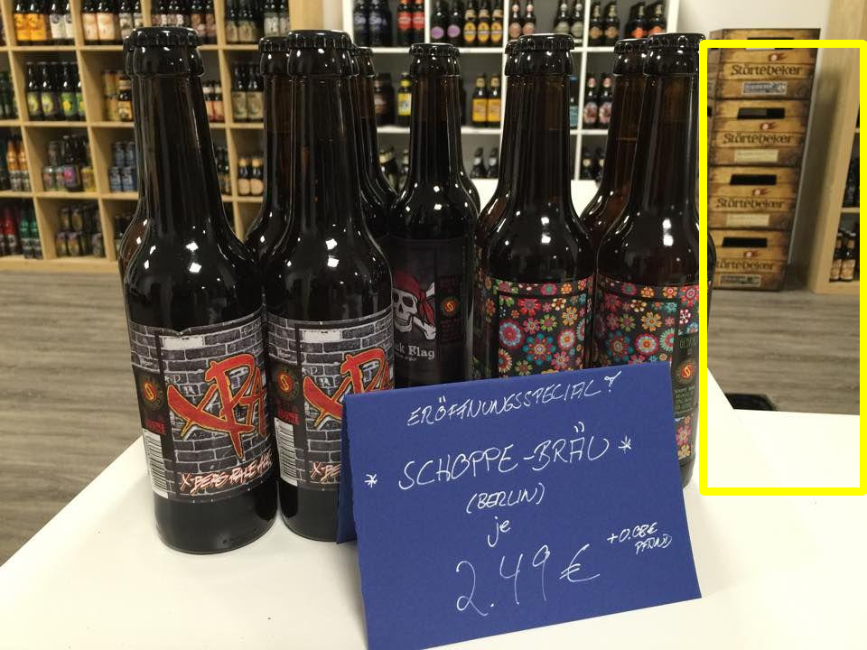      |       |                   |             |
| box      | 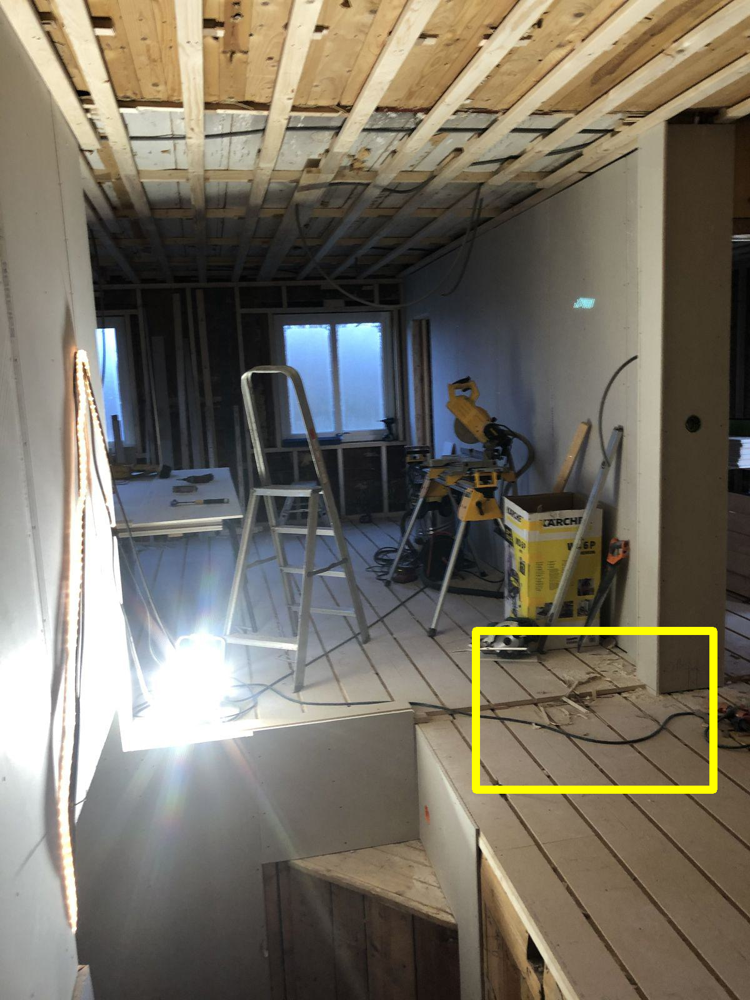            | 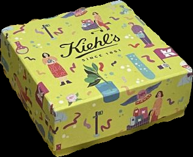            | 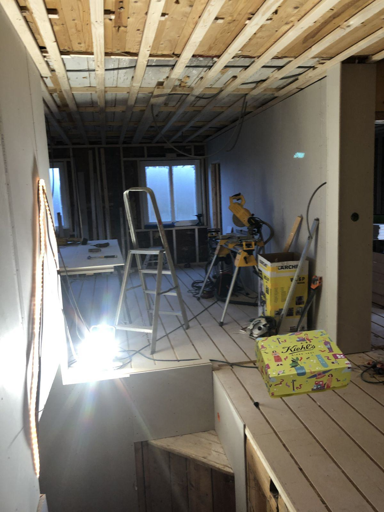                        | 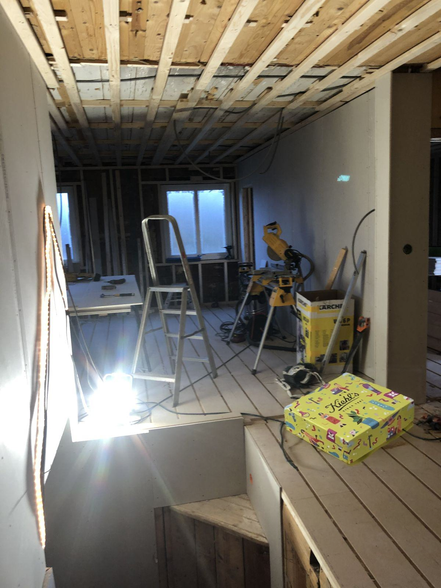                  |
| bus      | 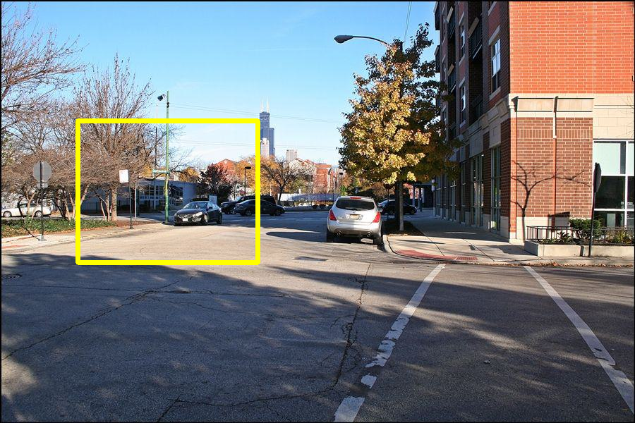            |             |                         |                   |
| cake     | 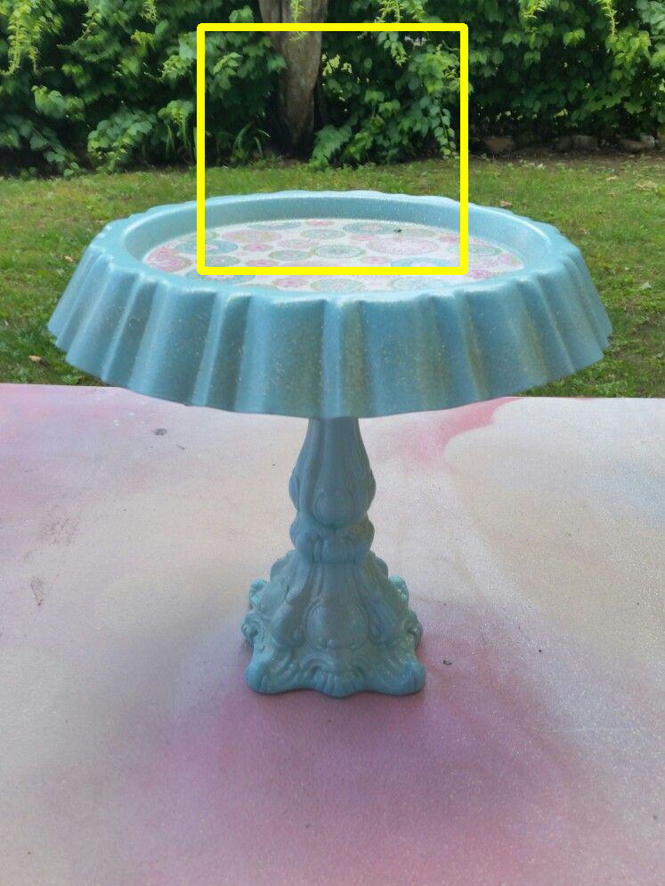          | 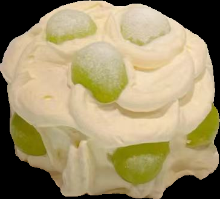          |                       |                 |
| keyboard |   |   |               |         |
| frame    | 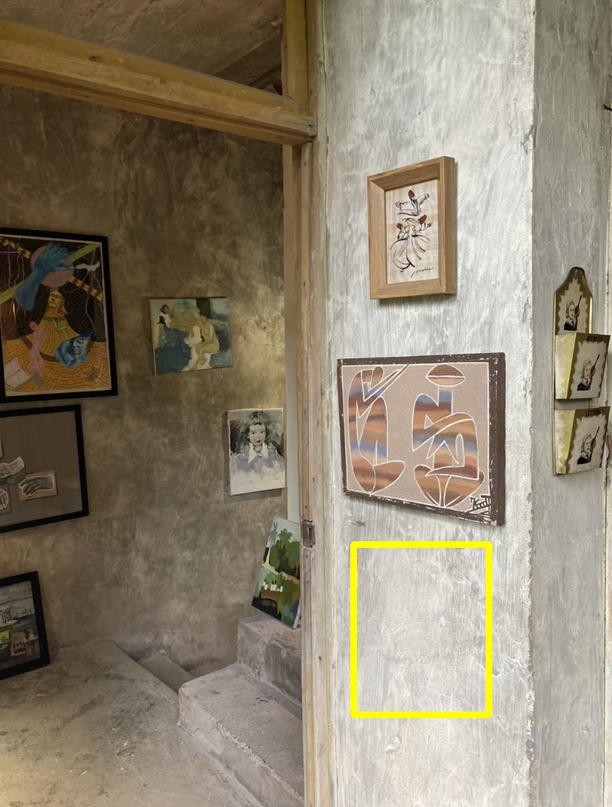        |         | 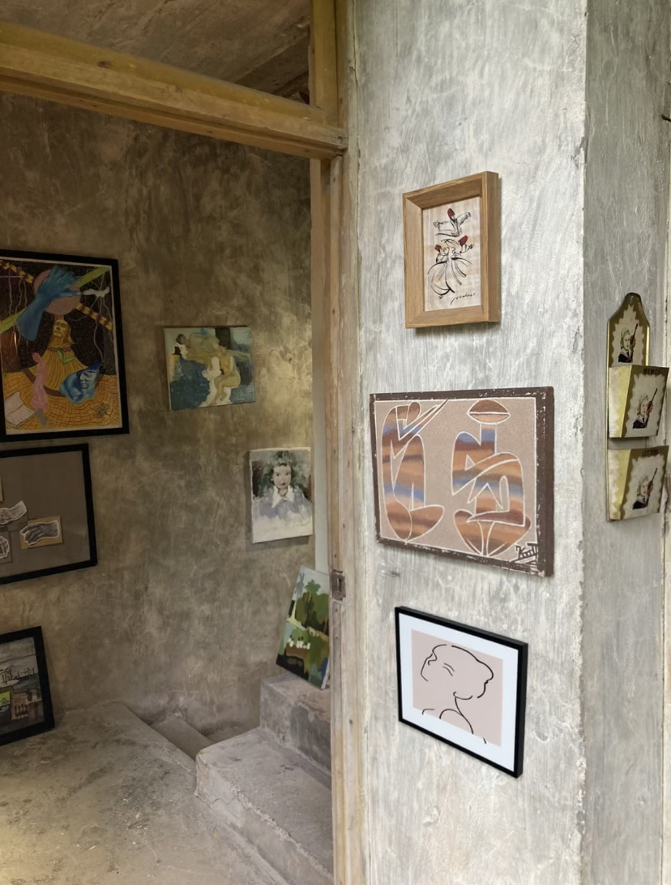                    | 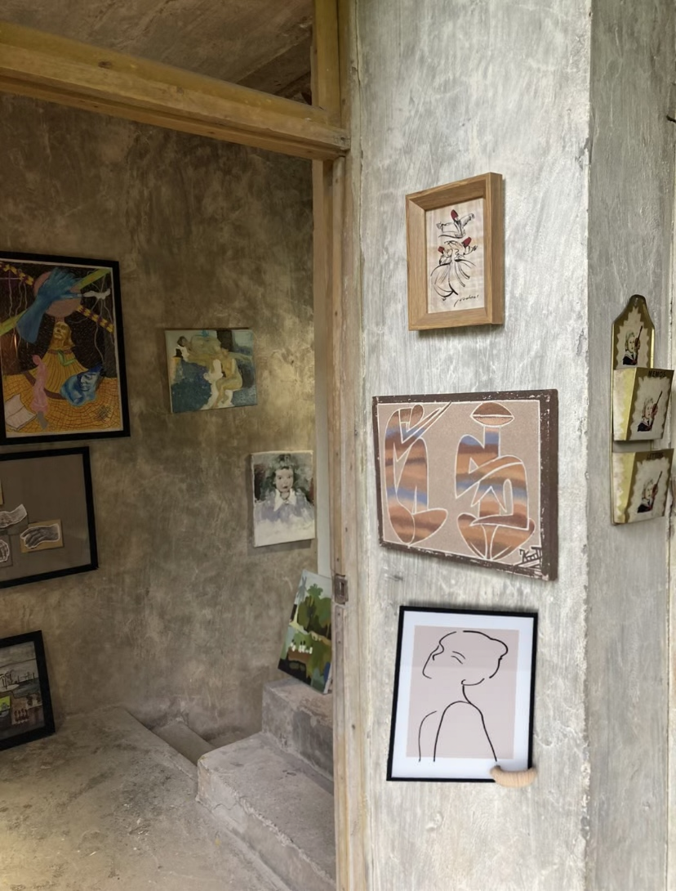              |

---

## 1. Quick Start

This section covers the full workflow from installing dependencies and downloading models to running the demo.

### 1.1 Environment & Dependencies

Example environment configuration:

- OS: Linux
- Python 3.10
- PyTorch ≥ 2.6.0

Dependency installation example:

```bash
conda create -n osinsert python=3.10
conda activate osinsert
pip install -r requirements.txt
```
Pre-installing numpy and pyarrow may solve some installation problems. The command is as follows:
```bash
conda create -n osinsert python=3.10 
conda activate osinsert
conda install -c conda-forge numpy pyarrow
pip install -r requirements.txt --only-binary=numpy,pyarrow
```
### 1.2 Diffusers Patch (aggressive mode mask switching)

Aggressive mode requires a modified `diffusers` `FluxFillPipeline` to support a two-phase mask schedule divided by split_ratio:
the first phase uses `sam_mask` and the second phase uses `bbox_mask`.

This repository includes `diffusers_osinsert/`, which enables the patch via a context manager only during the OSInsert pipeline call.
It is automatically restored afterwards, so it does not permanently affect other `diffusers` usage in the same Python process.

Optional verification (only to confirm the patched file path is from this repo):

```bash
python -c "import diffusers_osinsert as d; import diffusers.pipelines.flux.pipeline_flux_fill as m;\
with d.patch_context():\
    f=m.FluxFillPipeline.__call__; w=getattr(f,'__wrapped__',None);\
    print(getattr(w,'__code__',None).co_filename)"
```
### 1.3 Download Models & Directory Layout

You can create `model_dir/` directory and organize it as follows:

```bash
model_dir/
├── flux/
│   ├── FLUX.1-Fill-dev/
│   └── FLUX.1-Redux-dev/
├── insert_anything/
│   └── 20250321_steps5000_pytorch_lora_weights.safetensors
├── objectstitch/
│   └── v1/
│       ├── model.ckpt                      # -> ObjectStitch.pth
│       ├── configs/
│       │   └── v1.yaml
│       └── openai-clip-vit-large-patch14/  # CLIP weights directory
└── sam/
    └── sam_vit_h_4b8939.pth
```

### 1.4 Checkpoints

- **ObjectStitch checkpoint**:
  - openai-clip-vit-large-patch14  
    - HuggingFace: <https://huggingface.co/BCMIZB/Libcom_pretrained_models/blob/main/openai-clip-vit-large-patch14.zip>  
    - ModelScope: <https://www.modelscope.cn/models/bcmizb/Libcom_pretrained_models/file/view/master/openai-clip-vit-large-patch14.zip>
  - ObjectStitch.pth  
    - HuggingFace: <https://huggingface.co/BCMIZB/Libcom_pretrained_models/blob/main/ObjectStitch.pth>  
    - ModelScope: <https://www.modelscope.cn/models/bcmizb/Libcom_pretrained_models/file/view/master/ObjectStitch.pth>

- **SAM ViT-H**: `sam_vit_h_4b8939.pth`  
  - Official download: <https://dl.fbaipublicfiles.com/segment_anything/sam_vit_h_4b8939.pth>

- **InsertAnything LoRA** (recommended):  
  - Direct download: <https://huggingface.co/WensongSong/Insert-Anything/resolve/main/20250321_steps5000_pytorch_lora_weights.safetensors>

- **FLUX.1-Fill-dev / FLUX.1-Redux-dev**:  
  - FLUX.1-Fill-dev: <https://huggingface.co/black-forest-labs/FLUX.1-Fill-dev/tree/main/>  
  - FLUX.1-Redux-dev: <https://huggingface.co/black-forest-labs/FLUX.1-Redux-dev/tree/main/>

After downloading, organize all files according to the directory structure above. The following environment variables can override default paths: `FLUX_FILL_PATH`, `FLUX_REDUX_PATH`, `IA_LORA_PATH`, which can be modified in `tests/test_os_insert.py`.

---

## 2. Run the Demo 

The main entry script is `tests/test_os_insert.py`, which calls `libcom.os_insert.OSInsertModel`.

### 2.1 Example Data

The repository includes demo data under `examples/`, which contains the following files:

- `examples/background/Demo_0.png`
- `examples/foreground/Demo_0.png`
- `examples/foreground_mask/Demo_0.png`
- `examples/bbox/Demo_0.txt`

### 2.2 Running Conservative / Aggressive Modes

`tests/test_os_insert.py` exposes a `--mode` argument to select the running mode:

- `conservative`: use InsertAnything only, performing insertion within the bbox region on the background image.
- `aggressive`: full two-stage pipeline: ObjectStitch → SAM → InsertAnything.

Batch runs are supported via:

- `--uniq_ids`: comma-separated list of `uniq_id` values (e.g. `"Demo_0,Bus_2"`).
- `--split_ratios`: comma-separated list of aggressive-mode `split_ratio` values (e.g. `"0.33,0.5,0.67"`).

Notes:

- In `aggressive` mode, `split_ratio` controls the dynamic mask schedule: the first phase uses SAM mask and the second phase uses the bbox mask.
- In `conservative` mode, `split_ratio` does not affect the algorithm (the mask is always the bbox mask).

Example commands:

```bash
conda activate osinsert
cd OSInsert-Image-Composition

# Conservative mode (default)
python tests/test_os_insert.py --mode conservative --uniq_id Demo_0

# Aggressive mode (ObjectStitch + SAM + InsertAnything)
# Minimal aggressive demo (uses defaults: uniq_id=Demo_0, device=cuda:0, split_ratio=0.33, seed=123)
python tests/test_os_insert.py --mode aggressive

# Maximal / reproducible aggressive run (explicitly fix key knobs)
python tests/test_os_insert.py --mode aggressive --uniq_id Demo_0 --device cuda:0 --split_ratio 0.33 --seed 123

# Batch run: multiple uniq_ids
python tests/test_os_insert.py --mode aggressive --uniq_ids "Demo_0,Bus_2" --seed 123

# Sweep run: multiple split_ratio values (aggressive mode)
python tests/test_os_insert.py --mode aggressive --uniq_id Demo_0 --split_ratios "0.33,0.5,0.67" --seed 123

# Batch + sweep (cartesian product): uniq_ids x split_ratios
python tests/test_os_insert.py --mode aggressive --uniq_ids "Demo_0,Bus_2" --split_ratios "0.33,0.5" --seed 123

# Notes
# - You can freely remove optional flags (e.g. --device/--split_ratio/--seed/--verbose) and rely on defaults.
# - Use --uniq_id to switch which sample under examples/ to run.
```

Outputs are written to:

- `result_dir/osinsert_demo/`: conservative mode results.  
- `result_dir/osinsert_demo_aggressive/`: aggressive mode results.

In aggressive mode, setting `--verbose` additionally keeps intermediate files under `result_dir/*/intermediates/`, including:

- `objectstitch_coarse_rgb.png`: ObjectStitch coarse composite (BGR PNG).  
- `sam_mask.png`: raw SAM mask on the coarse composite.  
- `blended_source.png`: background and ObjectStitch composite blended by the SAM mask (source image).  
- `bbox_mask.png`: bbox (rectangular) mask used for the second phase.

### 2.3 OSInsertModel API Overview

The unified `OSInsertModel` is implemented in `libcom/os_insert/os_insert.py`:

```python
from libcom.os_insert import OSInsertModel
from libcom.os_insert.source.utils import load_bbox_txt

import cv2

model = OSInsertModel(model_dir="model_dir", device="cuda:0")

bg = cv2.imread("examples/background/Demo_0.png")
fg = cv2.imread("examples/foreground/Demo_0.png")
fg_mask = cv2.imread("examples/foreground_mask/Demo_0.png", cv2.IMREAD_GRAYSCALE)

bbox = tuple(load_bbox_txt("examples/bbox/Demo_0.txt"))

out = model.infer_images(
    background=bg,
    foreground=fg,
    foreground_mask=fg_mask,
    bbox_xyxy=bbox,               # (x1, y1, x2, y2)
    mode="aggressive",          # or "conservative"
    verbose=False,               # if True and save_path is set, save intermediates to save_path/intermediates
    seed=123,
    strength=1.0,
    split_ratio=0.33,            # first part SAM-mask, second part bbox-mask
    save_path="result_dir/osinsert_demo_aggressive",
)
```

The internal behavior is as follows:

- `conservative`:  
  - Use `background + bbox` to construct a rectangular mask.  
  - Call InsertAnything directly on this region.

- `aggressive`:  
  - ObjectStitch: generate a coarse composite `objectstitch_coarse.png` on the background.  
  - SAM: run SAM on the coarse composite with the bbox and obtain a binary mask.  
  - Blending: blend the original background and the coarse composite according to the SAM mask to form a new source image and mask (aligned to the original background resolution).  
  - InsertAnything: run InsertAnything on this region to obtain the final high-quality insertion result. During denoising, OSInsert uses a two-phase mask schedule: the first part of timesteps uses the ObjectStitch/SAM mask, and the remaining steps use a bbox (rectangular) mask to encourage more complete shadow/illumination synthesis.

In aggressive mode, `seed` is also used to seed the ObjectStitch sampling step so that results are reproducible.

---

## 3. Data Format

The data format of OSInsert follows the convention below:

- `background/{uniq}.png`
- `foreground/{uniq}.png`
- `foreground_mask/{uniq}.png`
- `bbox/{uniq}.txt` (content: `x1 y1 x2 y2`)

The TSV list file contains the following columns:

```text
uniq_id \t bg_path \t fg_path \t fg_mask_path
```

Typical usage:

- Directly reuse the demo files under `examples/` to verify the pipeline.  
- Replace the images with custom data while keeping the same filenames and directory structure.  
- Create a new TSV and `os_test` directory, and pass their paths via script arguments.

---

## 4. Configuration Notes

### 4.1 Where to modify checkpoint paths

For convenience, `tests/test_os_insert.py` contains a top-level `CONFIG` block where you can override all checkpoint paths (ObjectStitch / SAM / FLUX / LoRA) in one place. Any relative paths in that block are resolved against the repo root at runtime.

### 4.2 About `libcom/os_insert/source/ldm`

`libcom/os_insert/source/ldm` is a bundled copy of the minimal LDM code used by ObjectStitch.

When running, `libcom/os_insert/source/objectstitch_infer.py` automatically adds its own source directory to `sys.path`, so you do not need to manually set `PYTHONPATH` or any other environment variables.

---

## Other Resources
+ We summarize the papers and codes of generative image composition: [Awesome-Generative-Image-Composition](https://github.com/bcmi/Awesome-Generative-Image-Composition)
+ We summarize the papers and codes of image composition from all aspects: [Awesome-Image-Composition](https://github.com/bcmi/Awesome-Object-Insertion)
+ We summarize all possible evaluation metrics to evaluate the quality of composite images:  [Composite-Image-Evaluation](https://github.com/bcmi/Composite-Image-Evaluation)
+ We write a comprehensive survey on image composition: [the latest version](https://arxiv.org/pdf/2106.14490.pdf)
